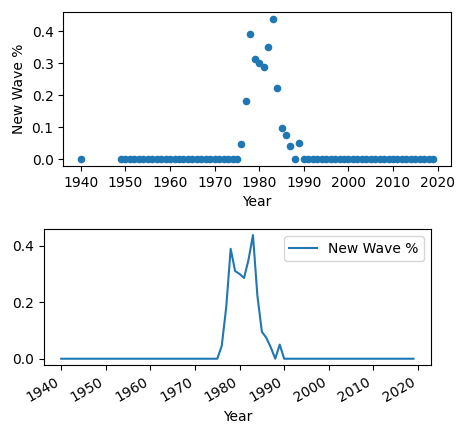
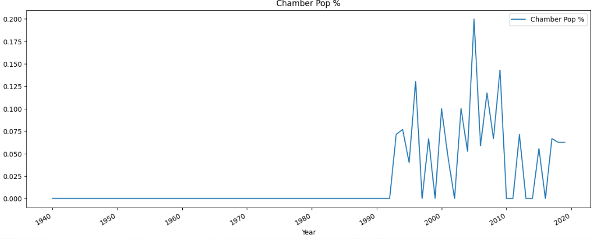
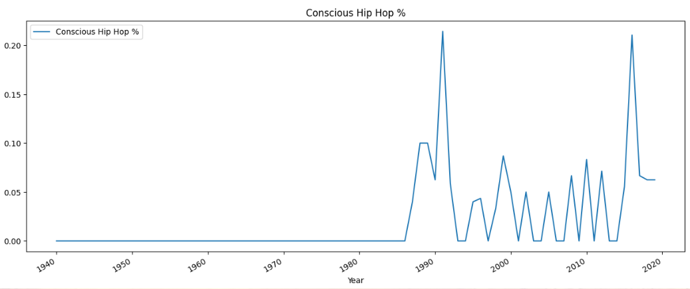
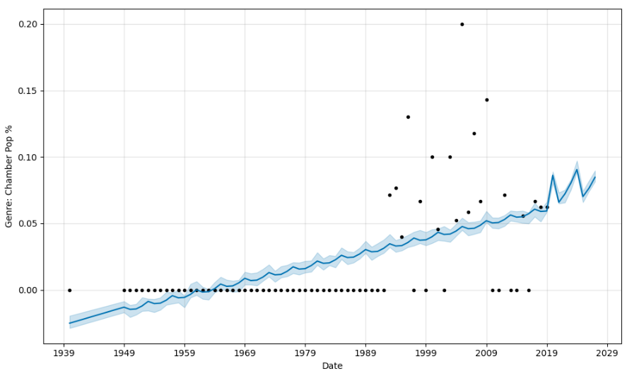
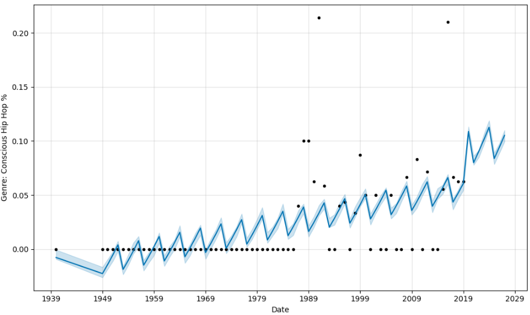

# Music Genres Forecasting with Prophet

This project aims to forecast the popularity trends of different music genres from 1940 to 2019 using Facebook's Prophet model. The dataset includes annual statistics on top genres, and the focus is to predict future trends in genre popularity.

**[Project Workflow](#project-workflow)** | **[Modeling](#modeling)** | **[Data Interpretation and Insights](#data-interpretation-and-insights)** | **[Predicting Future Genre Trends with Prophet](#predicting-future-genre-trends-with-prophet)** | **[Follow-On Studies](#follow-on-studies)**

---

## Abstract

This project involves forecasting trends in music genres using Facebook's Prophet model. The primary data includes historical genre popularity from 1940 to 2019. The steps include data preparation, visualization, and trend forecasting using time series modeling. This analysis aims to predict future trends and provide insights into genre popularity over time.

---

## Core Technologies, Tools

* **Languages/Tools:** Python, Jupyter Notebook, Google Colab
* **Libraries:** Prophet, pandas, matplotlib
* **Technologies:** Time Series Forecasting, Data Visualization, Predictive Modeling, Data Cleaning

---

## Project Workflow

#### **Data Collection**

* Loaded the dataset containing annual data of music genre popularity (`top_album_genres_1940_2019.csv`).
* The data was sourced as a CSV file and read into a Pandas DataFrame, setting the "Year" column as the index.

```
<class 'pandas.core.frame.DataFrame'>
RangeIndex: 3000 entries, 0 to 2999
Data columns (total 6 columns):
 #   Column          Non-Null Count  Dtype 
---  ------          --------------  ----- 
 0   Acclaimed Rank  3000 non-null   int64 
 1   Artist          3000 non-null   object
 2   Album           3000 non-null   object
 3   Genres          3000 non-null   object
 4   Year            3000 non-null   int64 
 5   album_link      3000 non-null   object
dtypes: int64(2), object(4)
memory usage: 140.8+ KB
None
```

#### **Pre-Processing**

* **Handling Missing or Inconsistent Data** : Dropped unnecessary columns, reset index for compatibility with Prophet, and handled missing data appropriately.
* **Feature Engineering** : Renamed columns to match Prophet's required format (`ds` for dates and `y` for the target).

#### **Feature Transformation**

*Cleaning, transforming, and preparing the raw data to ensure it is in a usable format.*

* **Data Formatting for Prophet** : Each genre column was formatted with columns `ds` (Year) and `y` (genre percentage) to train the model.

#### **Exploratory Data Analysis (EDA)**

*Inspected the data to understand patterns, trends, and relationships before modeling.*

* **Visualizations** : Created scatter and line plots for each genre to visualize trends over time and understand variations.
* **Descriptive Statistics** : Generated summary plots to analyze the popularity distribution of different genres.

---

## Modeling

#### **Model Selection**

* **Time Series Model** : Selected Facebook's Prophet model for time series forecasting due to its ability to handle yearly seasonality and missing data.
* **Model Setup** : Created and trained separate Prophet models for each genre column to predict future popularity.

#### **Hyperparameter Tuning**

* Used default Prophet parameters but adjusted the prediction interval (`interval_width=0.10`) for more precise forecasts.

#### **Evaluation and Scoring**

* **Forecasting** : Extended the time series forecast for each genre by 8 years into the future.
* **Visualization of Predictions** : Plotted the forecasted results for each genre using Prophet's built-in plotting tools.

---

## Data Interpretation and Insights

Prophet's forecasts provide insights into which genres are likely to gain or lose popularity over the next few years.  Scatter and Line Plots helped display historical trends in the data visually.  Here are a few of the trends noted in the data that map to historical events.  The plots will be shown below with links to wikipedia.  All Genre plots are available in the ipynb notebook in this project: 'music_genres_prophet.ipyn

#### **New Wave genre peak, late 1970s until late 1980s.**

> New wave commercially peaked from the late 1970s into the early 1980s with numerous major musicians and an abundance of one-hit wonders . MTV, which was launched in 1981, heavily promoted new-wave acts, boosting the genre's popularity in the United States.
>
> --source: https://en.wikipedia.org/wiki/New_wave_musi

<figure>
    <figcaption><em></em></figcaption>
    
</figure>

#### **Chamber Pop popularity rise, mid-1990s**

> In the mid-1990s, chamber pop developed as a subgenre of [indie rock](https://en.wikipedia.org/wiki/Indie_rock)[[4]](https://en.wikipedia.org/wiki/Chamber_pop#cite_note-FOOTNOTETonelli20043-4) or [indie pop](https://en.wikipedia.org/wiki/Indie_pop)[[5]](https://en.wikipedia.org/wiki/Chamber_pop#cite_note-AMIndiePop-5) in which musicians opposed the [distorted](https://en.wikipedia.org/wiki/Distortion_(music)) guitars, [lo-fi](https://en.wikipedia.org/wiki/Lo-fi_music) aesthetic, and simple arrangements common to the [alternative](https://en.wikipedia.org/wiki/Alternative_rock) or "[modern rock](https://en.wikipedia.org/wiki/Modern_rock)" groups of that era.
>
> -source: https://en.wikipedia.org/wiki/Chamber_pop

<figure>
    <figcaption><em></em></figcaption>
    
</figure>

#### **Conscious Hip-Hop popularity rise, early-1990s**

> As hip-hop rose in popularity during the 1980s, conscious rap emerged from within. Six years after “The Message”, New York-based hip-hop group Public Enemy made waves with their 1988 album, It Takes A Nation Of Millions To Hold Us Back. As the 1990s continued, so did conscious rap's prevalence.
>
> -source: hhttps://www.soundoflife.com/blogs/mixtape/conscious-rap-origin

<figure>
    <figcaption><em></em></figcaption>
    
</figure>

## Predicting Future Genre Trends with Prophet

Using the **Prophet model** in Google's Collab environment, I viewed each genre in a future dataframe (8 years into the future) to view the genre's historical popularity and anticipate any predicted rise in popularity for the gerne.

The project looped through the top 20 Genres, instantiated a new Prophet object for each (Prophet object can only be fit/trained once)., created future dataframe, and plotted predictions for the next 8 years:

```
['Alternative Rock %', 'Indie Rock %', 'Pop Rock %', 'Art Pop %', 'Art Rock %', 'Blues Rock %', 'Hard Rock %', 'New Wave %','Folk Rock %', 'Indie Pop %', 'Hard Bop %', 'Alt-Country %', 'Contemporary Folk %', 'Post-Punk %', 'Contemporary R&B %','Singer/Songwriter %', 'Chamber Pop %', 'Conscious Hip Hop %','Avant-Garde Jazz %', 'Britpop %']
```

```
# Reset the y value for each of the Genres
# Prophet object can only be fit once. Instantiate a new object for each Genre Dataframe
# Fit the Prophet model.
# Create a future dataframe to hold predictions
# Plot predictions including the future dataframe.

for genre in df.columns[1:]:
    prophet_df = df[['Year', genre]].rename(columns={'Year': 'ds', genre: 'y'})
    # Model
    model = Prophet(interval_width=0.10)# Prophet default is 80%
    # Fit/Train
    model.fit(prophet_df)
    # Predict: (set prediction to go out 8 years)
    future_trends = model.make_future_dataframe(periods=8, freq="Y")

# Make the predictions for the trend data using the future_trends DataFrame
    forecast_trends = model.predict(future_trends)
    # forecast_trends.head()

# Plot the Prophet predictions
    model.plot(forecast_trends, xlabel='Date', ylabel=(f'Genre: {genre}'))
```

From the **Chamber Pop** and **Conscious Hip-Hop** (example 2 and 3 above), Prophet predictions suggest that these genres will rise in popularity in the coming 8 years.


<figure>
    <figcaption><em></em></figcaption>
    
</figure>


`<figure>`
    `<figcaption><em>``</em></figcaption>`
    ``

<figure>
    <figcaption><em></em></figcaption>
    
</figure>


---

## Follow-On Studies

*Extend the time horizon for future forecasts to assess long-term genre trends.*
*Incorporate additional factors like album sales, record reviews, regional differences, or other features that might influence genre popularity.*

---
