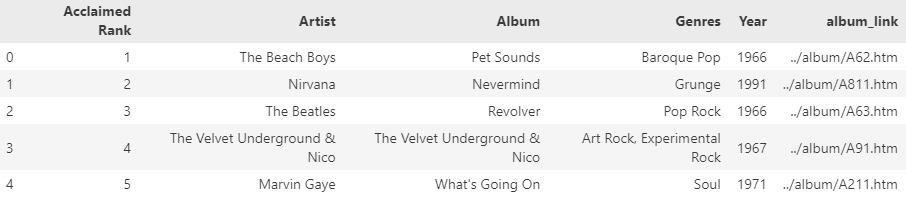
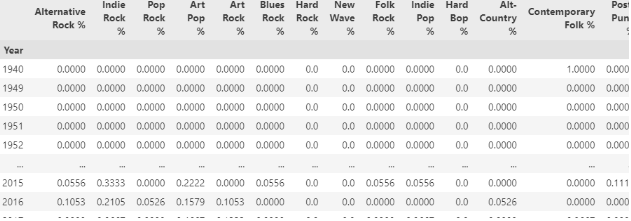
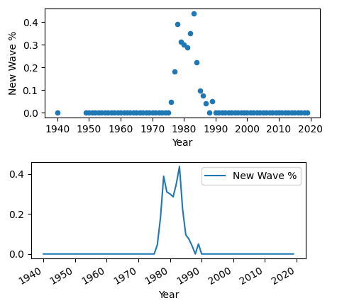
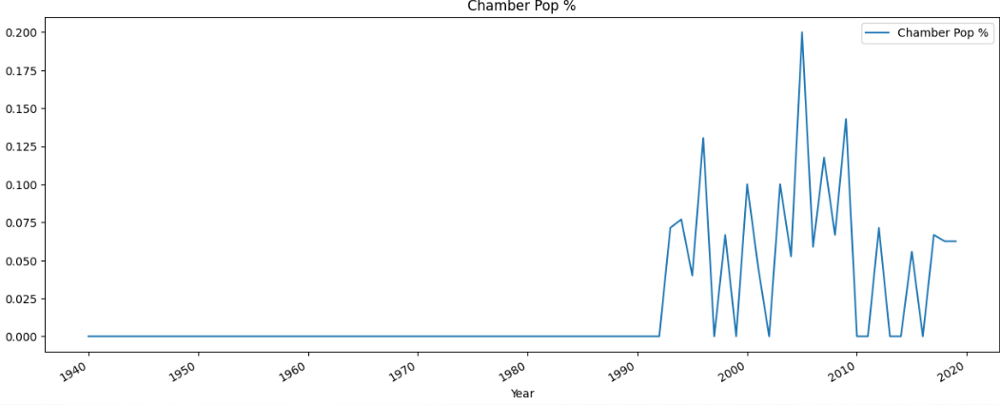
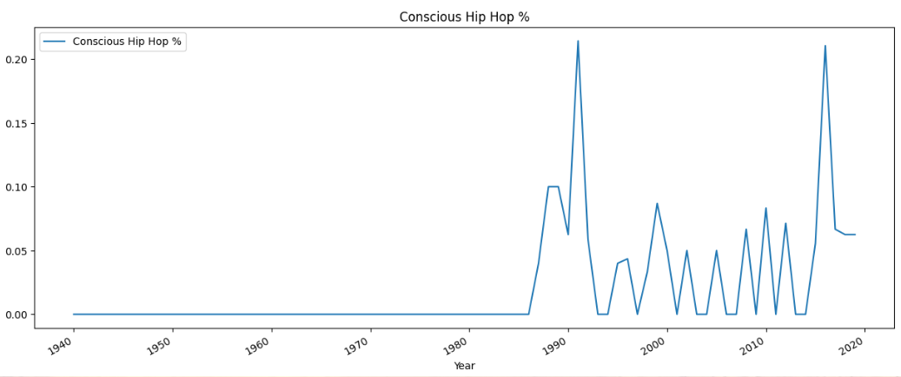
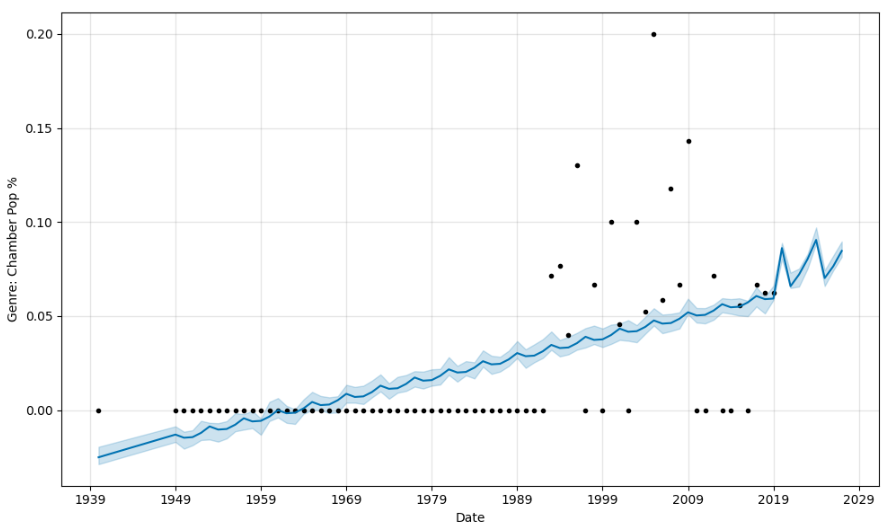
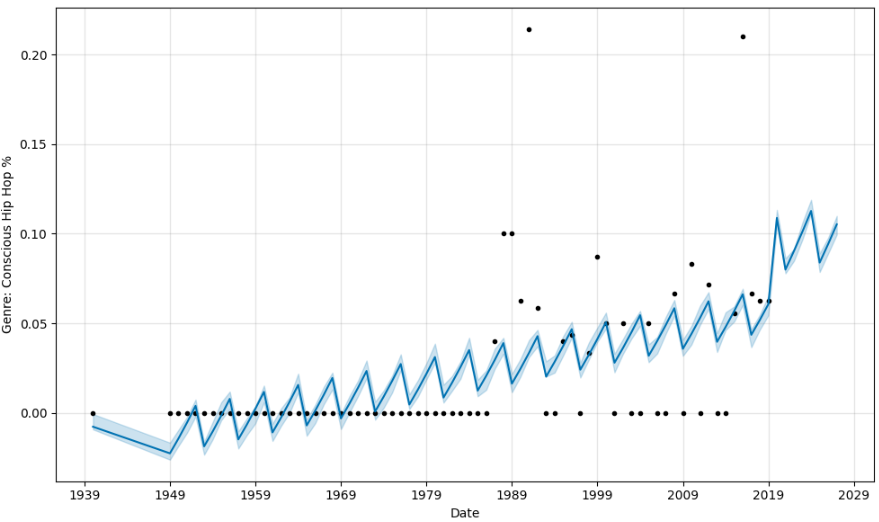
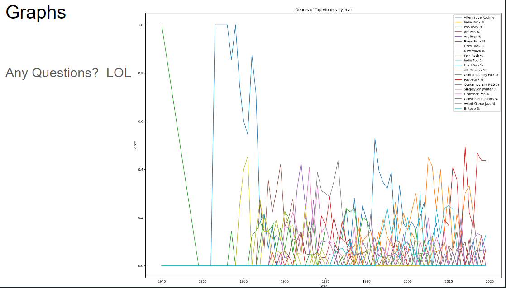

# top_selling_album_genres

### **I. Description:**

Study of top selling albums and the most represented genres by year.  Data sourced from acclaimedmusic.net to identify top 3000 albums from 1940-2019.

The goal is to aggregate and clean the data for these albums and investigate the rise and fall of the popularity of genres.

Prophet will be used to fit/train the model and predict future rises in popularity of genres.

## III. Data:

#### 1. Sourcing:

**Desired:** Album, Artist, Genres, Year, album_links (to get more album info)
**Source:** Acclaimed Music:All-Time Top 3000 albums
[https://acclaimedmusic.net/year/alltime_albums.htm](https://acclaimedmusic.net/year/alltime_albums.htm)

**Workbook:**

```
/Data_Sourcing/acclaimed_music_data_sourcing.ipynb
```

**Output:**

```
/Resources/acclaimed_albums_genres.csv
/Resources/acclaimed_albums_genres.pkl
```

```
<class 'pandas.core.frame.DataFrame'>
RangeIndex: 3000 entries, 0 to 2999
Data columns (total 6 columns):
 #   Column          Non-Null Count  Dtype 
---  ------          --------------  ----- 
 0   Acclaimed Rank  3000 non-null   int64 
 1   Artist          3000 non-null   object
 2   Album           3000 non-null   object
 3   Genres          3000 non-null   object
 4   Year            3000 non-null   int64 
 5   album_link      3000 non-null   object
dtypes: int64(2), object(4)
memory usage: 140.8+ KB
None
```



#### 2. Cleaning/Encoding:

**Desired:** Genres from the top albums by year, encoded for analysis.

Separted genres into primary, secondary, tertiatry and utlized primary genre (1st in each Genre list))

Encoded using One-Hot encoding, took counts, and selected the top 20 represented genres.  Grouped the genres by Year and summed.  Converted each value into a % of the total genres represented that year

**Workbook:**

```
/Data_Sourcing/acclaimed_album_genre_encode.ipynb
```

**Output:**

```
/Resources/top_album_genres_1940_2019.csv
/Resources/top_album_genres_1940_2019.pkl
```



#### 3. Modeling, Visualizing, Analysis:

**Workbook/Output:**

```
music_genres_prohet.ipynb

```

Utlized Prophet and Google Collab to model and visualize the data, as well as predict future values.

```
# Visually inspect the data for all the genres, as a line and a scatter plot

for genre in df.columns[1:]:
    df.plot(kind = 'scatter', x = 'Year', y = genre, figsize=(5, 2))
    df.plot(kind = 'line', x = 'Year', y = genre, figsize=(5, 2))
```

**Initial Visualizations:**

Scatter and Line Plots helped display historical trends in the data visually.

**Example 1: New Wave genre peak, starting in the late 1970s until late 1980s.**

Shown below with scatter and line plots.  (All Genre plots are available in the ipynb notebook in this project: 'music_genres_prophet.ipynb')

> **New wave commercially peaked from the late 1970s into the early 1980s with numerous major musicians and an abundance of one-hit wonders** . MTV, which was launched in 1981, heavily promoted new-wave acts, boosting the genre's popularity in the United States.
>
> --source: https://en.wikipedia.org/wiki/New_wave_music



**Example 2: Chamber Pop popularity rise, starting in the mid-1990s**

> In the mid-1990s, chamber pop developed as a subgenre of [indie rock](https://en.wikipedia.org/wiki/Indie_rock)[[4]](https://en.wikipedia.org/wiki/Chamber_pop#cite_note-FOOTNOTETonelli20043-4) or [indie pop](https://en.wikipedia.org/wiki/Indie_pop)[[5]](https://en.wikipedia.org/wiki/Chamber_pop#cite_note-AMIndiePop-5) in which musicians opposed the [distorted](https://en.wikipedia.org/wiki/Distortion_(music)) guitars, [lo-fi](https://en.wikipedia.org/wiki/Lo-fi_music) aesthetic, and simple arrangements common to the [alternative](https://en.wikipedia.org/wiki/Alternative_rock) or "[modern rock](https://en.wikipedia.org/wiki/Modern_rock)" groups of that era.
>
> -source: https://en.wikipedia.org/wiki/Chamber_pop



**Example 3: The rise of Conscious Hip-Hop, starting in the early-1990s**

> As hip-hop rose in popularity during the 1980s, conscious rap emerged from within.  Six years after “The Message”, New York-based hip-hop group Public Enemy made waves with their 1988 album, It Takes A Nation Of Millions To Hold Us Back.  As the 1990s continued, so did conscious rap's prevalence.
>
> -source: hhttps://www.soundoflife.com/blogs/mixtape/conscious-rap-origin



## Time Series Forecasting with Prophet

Using the Prophet model in Collab, reset the values for Year and each Genre to the required ds, y values for Prophet.

Looped through the top 20 list of Genres gathered, instantiated a new Prophet object for each (Prophet object can only be fit/trained once).  Created future dataframe (8 years into future) and plotted predictions using future dataframe.

```
['Alternative Rock %', 'Indie Rock %', 'Pop Rock %', 'Art Pop %', 'Art Rock %', 'Blues Rock %', 'Hard Rock %', 'New Wave %','Folk Rock %', 'Indie Pop %', 'Hard Bop %', 'Alt-Country %', 'Contemporary Folk %', 'Post-Punk %', 'Contemporary R&B %','Singer/Songwriter %', 'Chamber Pop %', 'Conscious Hip Hop %','Avant-Garde Jazz %', 'Britpop %']
```

```
# Reset the y value for each of the Genres
# Prophet object can only be fit once. Instantiate a new object for each Genre Dataframe
# Fit the Prophet model.
# Create a future dataframe to hold predictions
# Plot predictions including the future dataframe.

for genre in df.columns[1:]:
    prophet_df = df[['Year', genre]].rename(columns={'Year': 'ds', genre: 'y'})
    # Model
    model = Prophet(interval_width=0.10)# Prophet default is 80%
    # Fit/Train
    model.fit(prophet_df)
    # Predict: (set prediction to go out 8 years)
    future_trends = model.make_future_dataframe(periods=8, freq="Y")

# Make the predictions for the trend data using the future_trends DataFrame
    forecast_trends = model.predict(future_trends)
    # forecast_trends.head()

# Plot the Prophet predictions
    model.plot(forecast_trends, xlabel='Date', ylabel=(f'Genre: {genre}'))
```

From example 2 and 3 above, here are the Prophet predictions for the coming 8 years.

Both **Chamber Pop and Conscious Hip-Hop** are predicted by the model to be on the rise again.





#### Final Thoughts... :)

Early draft of a combined chart with top 20 genre data combined.


